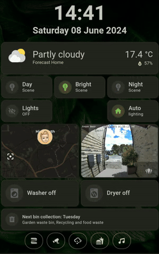
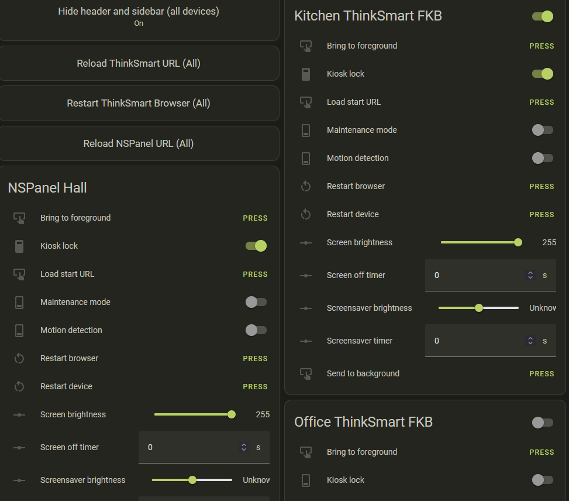

# ThinkSmart View Home Assistant dashboards #

This is a simple copy of one of my dashboards I use on my ThinkSmart View devices. The gif shows just a couple of screens. A fuller screen recording can be found [here](assets/images/dashboarddemo.mp4). I might create a demo for YouTube at some point.

[YAML file.](TSV_Dashboard.yaml)

#### Dependencies (HACS): ####

[lovelace-digital-clock](https://github.com/wassy92x/lovelace-digital-clock)

[lovelace-card-mod](https://github.com/thomasloven/lovelace-card-mod)

[Bubble-card](https://github.com/Clooos/Bubble-Card) (for the amazing popup support and lighting contgroller buttons)

[Mushroom card](https://github.com/piitaya/lovelace-mushroom)

[Kiosk mode](https://github.com/NemesisRE/kiosk-mode) (for the kiosk mode settings based on logged-in users)

#### Dependencies (HA entities etc): ####

The kiosk mode is controlled via a boolean helper called `input_boolean.kiosk_hide_header_and_sidebar` This is used in my management screen (as below).

### Optional buttons and popup screens ###

Samsung SmartThings Integration (Washer and Drier)

[Waste Collection Schedule](https://github.com/mampfes/hacs_waste_collection_schedule)

[Windy.com](https://www.windy.com) for the fabulous animated weather display

[Mealie add-on](https://github.com/alexbelgium/hassio-addons/tree/master/mealie) (for my recipe archive)

[Music Assistant](https://music-assistant.io/)
The ThinkSmart View does act as a player (via Fully Kiosk Browser) and sounds good. Currently there is a bug in the Music Assistant Fully Kiosk module that prevents tracks changing. It has been logged to be fixed at some point (hopefully the next release).

### Management Screen (optional) ###

This is a simple dashboard utilising the controls exposed by Fully Kiosk Browser. It's really handy as it allows me to control the devices, reload, restart etc. Also allows dynamic display of sidebar and header in kiosk mode - when you want to access other HA dashboards or settings on the TSV. Handy!

