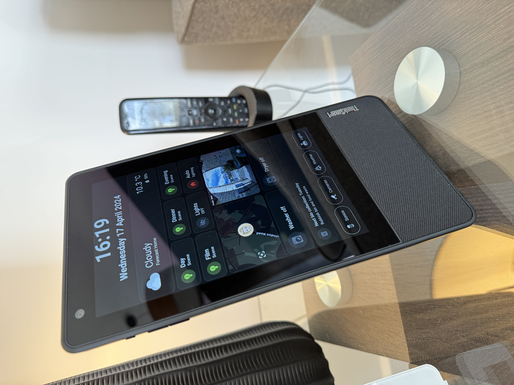

# ThinkSmart View Home Assistant dashboards #

This is a simple copy of one of my dashboards I use on my ThinkSmart View devices. The gif shows just a couple of screens. A fuller screen recording can be found [here](assets/images/dashboarddemo.mp4). I might create a demo for YouTube at some point.

[YAML file.](TSV_Dashboard.yaml)

You'll need to crteate a new dashboard, edit it in raw mode from the dashboard view (top right pencil-three dots-Raw configuration editor) and paste in the code. Expect to make *extensive* modifications as dashboard rely heavily on a users HA setup. Hopefully this will give some ideas or a starting point if you like this type of approach.

#### Dependencies (HACS): ####

There are quite a few dependencies but all of these are common, robust, well-supported and very useful anyway.

[lovelace-digital-clock](https://github.com/wassy92x/lovelace-digital-clock)

[lovelace-card-mod](https://github.com/thomasloven/lovelace-card-mod)

[Bubble-card](https://github.com/Clooos/Bubble-Card) (for the amazing popup support and lighting contgroller buttons)

[Mushroom card](https://github.com/piitaya/lovelace-mushroom)

[Kiosk mode](https://github.com/NemesisRE/kiosk-mode) (for the kiosk mode settings based on logged-in users)

[Layout-card](https://github.com/thomasloven/lovelace-layout-card) (for the vertical layout card that Bubble Card needs)

[stateful-scenes](https://github.com/hugobloem/stateful_scenes) (This tracks the state of scenes in HA and is in beta for Philips Hue scenes. It currently doesn't work for Hue scenes but hopefully will in the future when it's been developed further/debugged)

[Philips Hue Icons](https://github.com/arallsopp/hass-hue-icons) (optional) Philips Hue icons

#### Dependencies (HA entities etc): ####

- The kiosk mode is controlled via a boolean helper called `input_boolean.kiosk_hide_header_and_sidebar` This is used in my management screen (as below).

- The conditional popups for my water softener and leak detectors are based on Aqara water leak sensors

- My camera feed comes from a Reolink video doorbell, linked to a Frigate rtsp stream setup in HA using the Generic Camera integration. I found this to be the best performing option after testing a whole load of different options. It's fairly light-weight and runs on all my devices with no issues.

### Optional buttons and popup panels ###

Samsung SmartThings Integration (Washer and Drier)

[Waste Collection Schedule](https://github.com/mampfes/hacs_waste_collection_schedule)

[Windy.com](https://www.windy.com) for the fabulous animated weather display

[Mealie add-on](https://github.com/alexbelgium/hassio-addons/tree/master/mealie) (for my recipe archive)

[Music Assistant](https://music-assistant.io/)
The ThinkSmart View does act as a player (via Fully Kiosk Browser) and sounds good. Currently there is a bug in the Music Assistant Fully Kiosk module that prevents tracks changing. It has been logged to be fixed at some point (hopefully the next release).

[The dark olive green theme I use](https://github.com/AmoebeLabs/HA-Theme_M3-07-DarkOliveGreen)

### Other features ###

- I also have popups triggered by the Reolink video doorbell being pushed and Frigate detecting a person or animal. This triggers the Bubble Card popup via a boolean helper. I also send TTS to the devices around the house using HA Cloud for fabulous sounding voices (I like OliviaNeural best).

- Conditional popus also include if the letterbox sensor has been triggered.

- I run these dashboards on [Fully Kiosk Browser](https://www.fully-kiosk.com/). Wallpanel will also work but doesn't give as many features to control the device.

- I plan on adding conditional popups for my iParcelBox to say when a parcel has been delivered. It does already on an NSPanelPro in my hallway.

### Management Screen (optional) ###

This is a simple dashboard utilising the controls exposed by Fully Kiosk Browser. It's really handy as it allows me to control the devices, reload, restart etc. Also allows dynamic display of sidebar and header in kiosk mode - when you want to access other HA dashboards or settings on the TSV. Handy!

For any further questions - feel free to write in the Discussions area in GitHub.

